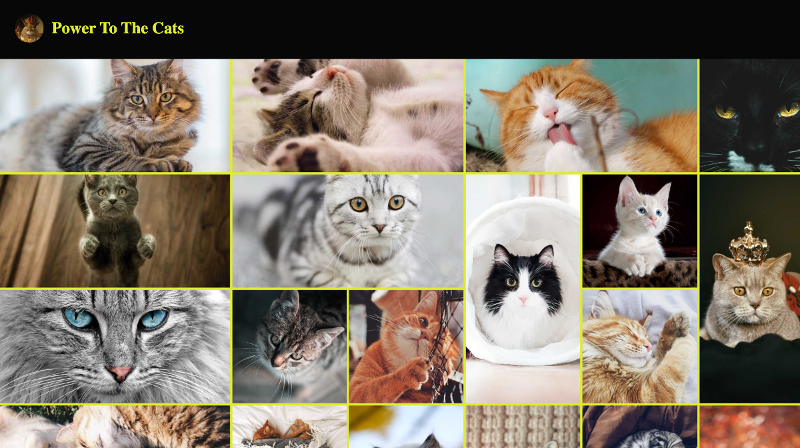

<!-- AUTO-GENERATED-CONTENT:START (STARTER) -->
<p align="center">
  <a href="https://www.gatsbyjs.org">
    
  </a>
</p>
<h1 align="center">
  Power To The Cats
</h1>

Usage of CSS Grid Layout to create a Responsive image Gallery.
The images are displayed differently regarding their ratio.

Horizontal Mode / Vertical Mode/ Normal Mode

## 🚀 Démo

https://power-to-the-cats.netlify.app/

## 🚀 Quick start

1.  **Start developing.**

    Navigate into your new site’s directory and start it up.

    ```shell
    cd gatsby-power-to-the-cats/
    gatsby develop
    ```

1.  **Open the source code and start editing!**

    Your site is now running at `http://localhost:8000`!
